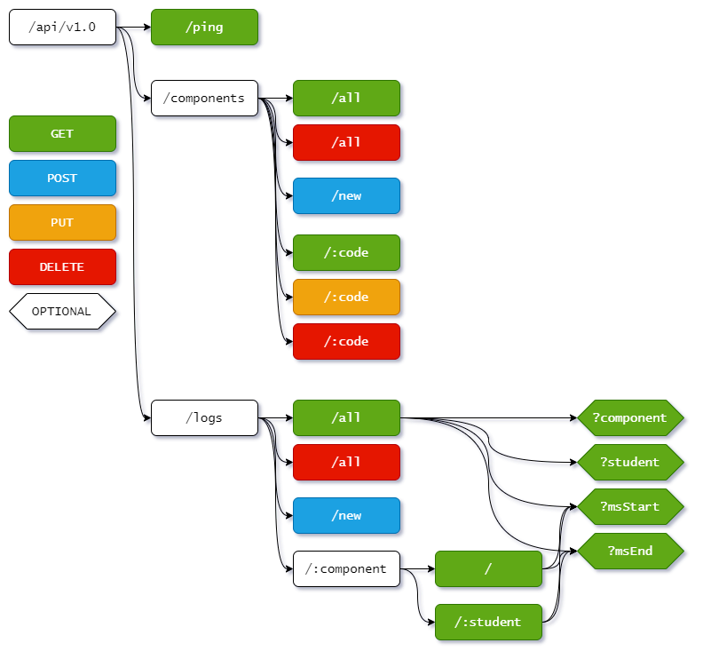

# StudentOwl-API

## API del proyecto

## Nueva estructura del proyecto

Se _reescribio_ todo el codigo, para dar uso de las nuevas caracteristicas de **JavaScript moderno**, se implemento manejadores de **errores** y **Loggers**, ademas de configurar `.env` correctamente.

## Comandos

### Install depedencies

Para poder usar el proyecto se debe instalar las depensendias

```bash
npm install
```

Si NPM no instala las dependencias de desarrollo como `babel-core`, ejecuta el siguiente comando:

```bash
npm install --dev
```

Ademas de configurar las variables de entorno.

Crearemos un archivo `.env` a nivel del proyecto.

> En el archivo `.env.dist` se enecuentra la plantilla de las variables de etorno.

Ya est listo para continuar...

### Development

Para ejecutar el servidor en modo desarrollo ejecutar:

```bash
npm run dev
```

### Test

Para comprobar las pruebas unitarias

```bash
npm run test
```

### Build

Para compilar el proyecto ejecutar:

```bash
npm run build
```

## Ruta de Endpoints

A continuación se muestra el diagrama del estado actual de los endpoints existentes:



### Variables

`:component`: Codigo del componente academico -> `AAAA00`

`:code`: Codigo del componente academico -> `AAAA00`

`:student`: Id del estudiante -> `ablopez`

`:msStart`: Fecha inicial de busqueda en ms -> `1234567890123`

`:msStart`: Fecha final de busqueda en ms -> `1234567890123`

### Definicion de los endpoints

Comprueba que la API este _online_

> `/api/v1.0/ping`

Devuelve todos los componentes academicos

> `/api/v1.0/components/all`

Crea un nuevo componente academico

> `/api/v1.0/components/new`

Devuelve un componente academico

> `/api/v1.0/components/AAAA00`

Devuelve todos los _logs_ del componente

> `/api/v1.0/AAAA00`

Filtra los _logs_ del componente por tiempo

> `/api/v1.0/AAAA00/1234567890123`

> `/api/v1.0/AAAA00/1234567890123>1234567890123`

Devuelve todos los _logs_ del estudiante en un componente

> `/api/v1.0/AAAA00/ablopez`

Filtra los _logs_ del estudiante en un componente por tiempo

> `/api/v1.0/AAAA00/ablopez/1234567890123`

> `/api/v1.0/AAAA00/ablopez/1234567890123-1234567890123`
